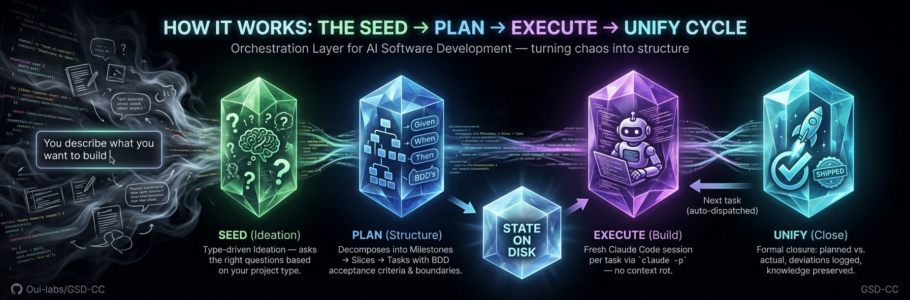

<p align="center">
  
</p>

<p align="center">
  <strong>Get (hot) Shit Done — GSD on steroids, for Claude Code.</strong><br/>
  Structured AI development on your Max Plan. Zero API costs. Zero dependencies.
</p>

<p align="center">
  <a href="https://www.npmjs.com/package/gsd-cc"></a>
  <a href="LICENSE"></a>
  <a href="https://github.com/0ui-labs/GSD-CC/stargazers"></a>
</p>

---

## Why GSD-CC?

GSD pioneered structured AI development. Then GSD v2 dropped Claude Code for its own agent. We picked it back up — and added steroids.

|  | GSD v2 | GSD-CC |
|---|---|---|
| **Runtime** | Custom agent (PI SDK) | Claude Code (native) |
| **Costs** | API keys, pay-per-token | Max Plan (flat rate) |
| **Dependencies** | TypeScript, build pipeline | Markdown + Bash, zero deps |
| **Claude Code updates** | Manual migration | Automatic — you're native |
| **Quality control** | — | Mandatory UNIFY after every slice |
| **Boundary enforcement** | — | Explicit DO NOT CHANGE rules per task |
| **Custom project types** | — | Drop 3 files, done |
| **Installation** | Clone, configure, build | `npx gsd-cc` |

## The Problem

AI coding agents are powerful but break down over time. Claude Code excels at clearly defined tasks that fit in a single context window. But real software is hundreds of tasks over days and weeks.

**Context rot** — the longer a session runs, the more noise accumulates. Quality degrades, Claude forgets decisions, repeats itself. **No memory between sessions** — close Claude Code, reopen it tomorrow, everything is gone. **No structured plan** — "build me X" works for a todo app, not for a booking system with auth, API, and deployment. **No quality control** — nobody checks if what was built matches what was planned.

## Our Approach

The right solution is not another coding agent. Claude Code is the best available agent — maintained by an entire team at Anthropic, improved monthly, with subagents, plan mode, agent teams, and dozens of features no solo project can replicate.

GSD v2 bet against this. They replaced Claude Code with a custom agent built on the PI SDK. That means API costs per token, a TypeScript codebase to maintain, and no access to new Claude Code features.

**We bet the other way.** Claude Code is the agent. GSD-CC is the orchestration layer — it tells Claude Code *what* to do and *in what order*, not *how* to write code. Implemented as native Claude Code Skills (Markdown) plus a Bash script. No build step. No dependencies. If Anthropic ships Claude Code 3.0 tomorrow, GSD-CC benefits automatically.

## What GSD-CC Adds

### Mandatory UNIFY — Plan vs. Actual

After every slice, UNIFY runs. Not optional. The router blocks until it's done. It compares what was planned with what was built, documents deviations and decisions, and ensures the next slice builds on facts — not assumptions. This is the single most important quality mechanism missing from GSD.

### Boundaries — DO NOT CHANGE

Every task plan includes explicit boundaries: files, modules, and systems that Claude must not touch. This prevents the #1 problem with AI coding — Claude "helpfully" refactoring code you didn't ask it to touch.

### Type-Driven Ideation

A REST API needs different questions than a landing page. GSD-CC detects your project type and adjusts: question depth, rigor level, and how aggressively auto-mode operates. Five built-in types, or drop 3 Markdown files to add your own.

### Max Plan, Not API Keys

GSD-CC uses `claude -p` (non-interactive mode) for autonomous execution. That runs on your Max Plan — fixed monthly cost, no token anxiety. For a project with hundreds of tasks, this saves serious money compared to API-based approaches.

### The Best of Three Systems

**From GSD:** Milestones → Slices → Tasks. Fresh sessions per task prevent context rot. State on disk enables autonomous execution.

**From PAUL:** Formal work unit closure (UNIFY). BDD acceptance criteria (Given/When/Then). Decision tracking across slices.

**From SEED:** Type-driven question quality. Rigor levels (tight/standard/deep/creative). Better questions → better plans → better code.

## Getting Started

### Prerequisites

- [Claude Code](https://docs.anthropic.com/en/docs/claude-code) installed
- Claude Code **Max Plan** (recommended for autonomous mode)
- **Git** initialized in your project
- **jq** installed (`brew install jq`) — required for auto-mode

### Installation

```bash
npx gsd-cc            # Install globally (default)
npx gsd-cc --local    # Install to current project only
npx gsd-cc --uninstall
```

### Quick Start

```bash
~/my-project $ claude
```

```
> /gsd-cc

  No .gsd/ directory found. Let's start a new project.
  What are you building?

> A REST API for a booking system with React frontend

  Got it. That's an application project.
  Setting rigor to deep — architecture matters here.

  Let's explore this together. I'll ask about 8 areas...
```

After 8-10 minutes of guided exploration, you have a `PLANNING.md`. From there:

```
> /gsd-cc           → creates the roadmap
> /gsd-cc           → plans the first slice (tasks with ACs + boundaries)
> /gsd-cc           → "Execute? manual or auto?"
> auto              → runs tasks autonomously, UNIFY after each slice
```

Come back hours later:
```
> /gsd-cc           → "Welcome back. M001 — 4 of 6 slices complete."
```

### Commands

You only need `/gsd-cc` — it routes automatically. Power users can jump directly:

| Command | Phase | What it does |
|---------|-------|-------------|
| `/gsd-cc` | Router | Reads state, suggests ONE next action |
| `/gsd-cc-seed` | Ideation | Type-driven project exploration (coach mode) |
| `/gsd-cc-discuss` | Discussion | Resolve ambiguities before planning |
| `/gsd-cc-plan` | Planning | Research + decompose into tasks with ACs |
| `/gsd-cc-apply` | Execution | Execute tasks with boundary enforcement |
| `/gsd-cc-unify` | Reconciliation | Plan vs. actual comparison (mandatory) |
| `/gsd-cc-auto` | Auto-mode | Autonomous execution via `claude -p` |
| `/gsd-cc-status` | Overview | Progress, ACs, token usage, auto-mode state |
| `/gsd-cc-help` | Reference | All commands, project files, and tips |
| `/gsd-cc-tutorial` | Learning | Guided walkthrough with a sample project |
| `/gsd-cc-update` | Maintenance | Update to the latest version |

## How It Works

<p align="center">
  
</p>

### State on Disk

All project state lives in a `.gsd/` directory:

- Plans, task definitions, and acceptance criteria
- Execution logs and decision records
- Deviation tracking from the UNIFY step
- Progress state for the auto-loop

Close Claude Code, come back tomorrow, pick up exactly where you left off.

## Adding Custom Project Types

Drop 3 files into `~/.claude/skills/gsd-cc-seed/types/your-type/`:

```
types/my-saas/
├── guide.md      # Conversation sections (Explore/Suggest/Skip-Condition)
├── config.md     # rigor: deep | sections: 8 | demeanor: strategic
└── loadout.md    # Recommended tools and libraries
```

Next time `/gsd-cc-seed` runs, your type is available. See the built-in types (`application`, `workflow`, `utility`, `client`, `campaign`) for examples.

## Acknowledgments

GSD-CC builds on ideas from:

- **[GSD](https://github.com/get-shit-done/gsd)** — Pioneered structured AI development with the Milestone → Slice → Task hierarchy
- **PAUL** — Introduced formal work unit closure (UNIFY) and BDD acceptance criteria as first-class planning primitives
- **SEED** — Demonstrated that better questions produce better plans through type-driven ideation

## License

[MIT](LICENSE)
