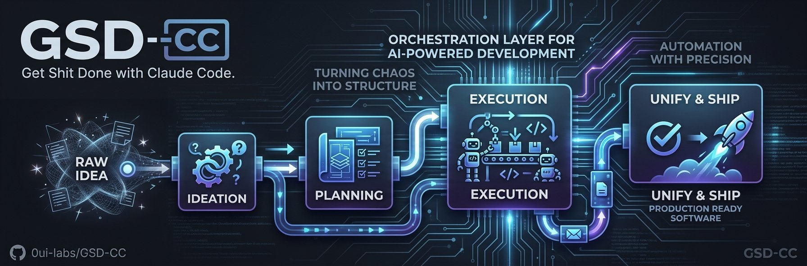

<p align="center">
  
</p>

<p align="center">
  <strong>A project management system for AI-powered software development.</strong><br/>
  Structure your ideas, break them into executable units, and let Claude Code do the work — guided or fully autonomous.
</p>

---

## The Problem

AI coding agents are powerful but unreliable over time. Claude Code excels at clearly defined tasks that fit in a single context window. But real software consists of hundreds of tasks that build on each other over days and weeks. Every current approach breaks down in one of these ways:

**Context Rot.** The longer a session runs, the more noise accumulates in the context window. Quality degrades. Claude becomes vague, forgets decisions, repeats itself. Eventually the session is useless.

**No Memory Between Sessions.** Close Claude Code, reopen it tomorrow — it knows nothing. Architecture decisions, changed files, the plan? All gone.

**No Structured Plan.** Most developers open Claude Code and say "build me X". Fine for a todo app. For a booking system with auth, API, frontend, and deployment, it's a recipe for inconsistent, unstructured code.

**No Quality Control.** Nobody checks whether what was built matches what was planned. Decisions are made and forgotten. Deviations accumulate invisibly. You end up with software that "sort of works" but doesn't match the design.

## Our Thesis

The right solution is not another coding agent. Claude Code is already the best available agent — maintained by an entire team at Anthropic, regularly improved, with subagents, agent teams, plan mode, and dozens of features no solo project can replicate.

What's missing is an **orchestration layer**: a system that tells Claude Code *what* to do and *in what order* — not *how* to write code. This layer needs:

1. **Structure** — a hierarchy that breaks large projects into context-window-sized units
2. **State on Disk** — so knowledge survives between sessions
3. **Discipline** — so every work unit is formally closed before the next one begins
4. **An Outer Loop** — that automatically dispatches the next task when the previous one finishes

All of this can be implemented as Claude Code Skills (Markdown instructions) plus a Bash script (the outer loop). No TypeScript project, no build step, no dependencies beyond Claude Code itself.

## What GSD-CC Does Differently

### Claude Code Is the Agent, Not the Victim

GSD v1 gives Claude Code prompts and *hopes* it follows them. GSD v2 replaced Claude Code entirely with a custom agent. GSD-CC takes the third path: it uses Claude Code for what it is — a powerful coding agent — and gives it precise, phase-specific instructions through Claude Code's native skill system.

No hoping, no replacing. Collaboration.

### Max Plan Instead of API Costs

The Claude Code Max Plan costs a fixed monthly fee with 5x or 20x more usage than Pro. GSD v2 with the Pi SDK requires API keys and charges per token — for a project with hundreds of tasks, that gets expensive.

GSD-CC uses `claude -p` (Claude Code's non-interactive mode), which runs on the Max Plan. Same performance, predictable costs.

### The Best of Three Systems

Instead of inventing from scratch, GSD-CC takes the most proven concepts from three years of ecosystem development:

**From GSD:** The idea that software is decomposed into Milestones → Slices → Tasks, where each task fits in a context window. Fresh sessions per task prevent context rot. A state machine on disk enables autonomous execution. Git branches per slice keep the history clean.

**From PAUL:** The insight that every work unit must be formally closed. The UNIFY step compares what was planned with what happened, logs deviations and decisions, and ensures the next slice builds on correct knowledge — not assumptions. Plus: Acceptance Criteria in BDD format (Given/When/Then) as first-class citizens in the planning format, and explicit Boundaries (DO NOT CHANGE) that prevent Claude from touching unrelated code.

**From SEED:** The recognition that planning quality depends on question quality — and the right questions depend on the project type. A REST API project needs questions about endpoints and auth. A client website needs questions about conversion and content. SEED's type-driven rigor system (tight/standard/deep/creative) influences not just ideation but how aggressively the auto mode operates.

### Zero Maintenance Overhead

GSD-CC consists of Markdown files and a Bash script. No dependencies that go stale. No build pipeline that breaks. No framework updates with breaking changes. If Anthropic releases Claude Code 3.0 tomorrow with better subagents, GSD-CC benefits automatically — because Claude Code is the runtime, not a wrapper around it.

## Getting Started

### Prerequisites

- [Claude Code](https://docs.anthropic.com/en/docs/claude-code) installed
- Claude Code **Max Plan** (recommended for autonomous mode)
- **Git** initialized in your project
- **jq** installed (`brew install jq`) — required for auto-mode

### Installation

```bash
npx gsd-cc            # Install globally (default)
npx gsd-cc --local    # Install to current project only
npx gsd-cc --uninstall
```

### Quick Start

```bash
~/my-project $ claude
```

```
> /gsd

  No .gsd/ directory found. Let's start a new project.
  What are you building?

> A REST API for a booking system with React frontend

  Got it. That's an application project.
  Setting rigor to deep — architecture matters here.

  Let's explore this together. I'll ask about 8 areas...
```

After 8-10 minutes of guided exploration, you have a `PLANNING.md`. From there:

```
> /gsd              → creates the roadmap
> /gsd              → plans the first slice (tasks with ACs + boundaries)
> /gsd              → "Execute? manual or auto?"
> auto              → runs tasks autonomously, UNIFY after each slice
```

Come back hours later:
```
> /gsd              → "Welcome back. M001 — 4 of 6 slices complete."
```

### Commands

You only need `/gsd` — it routes automatically. Power users can jump directly:

| Command | Phase | What it does |
|---------|-------|-------------|
| `/gsd` | Router | Reads state, suggests ONE next action |
| `/gsd-seed` | Ideation | Type-driven project exploration (coach mode) |
| `/gsd-discuss` | Discussion | Resolve ambiguities before planning |
| `/gsd-plan` | Planning | Research + decompose into tasks with ACs |
| `/gsd-apply` | Execution | Execute tasks with boundary enforcement |
| `/gsd-unify` | Reconciliation | Plan vs. actual comparison (mandatory) |
| `/gsd-auto` | Auto-mode | Autonomous execution via `claude -p` |
| `/gsd-status` | Overview | Progress, ACs, token usage, auto-mode state |

## How It Works

```
You describe what you want to build
        │
        ▼
┌─────────────────┐
│      SEED        │  Type-driven ideation — asks the right
│    (Ideation)    │  questions based on your project type
└────────┬────────┘
         │
         ▼
┌─────────────────┐
│      PLAN        │  Decomposes into Milestones → Slices → Tasks
│   (Structure)    │  with BDD acceptance criteria & boundaries
└────────┬────────┘
         │
         ▼
┌─────────────────┐
│     EXECUTE      │  Fresh Claude Code session per task
│   (Build)        │  via `claude -p` — no context rot
└────────┬────────┘
         │
         ▼
┌─────────────────┐
│      UNIFY       │  Formal closure: planned vs. actual,
│   (Close)        │  deviations logged, knowledge preserved
└────────┬────────┘
         │
         ▼
      Next task (auto-dispatched)
```

### State on Disk

All project state lives in a `.gsd/` directory:

- Plans, task definitions, and acceptance criteria
- Execution logs and decision records
- Deviation tracking from the UNIFY step
- Progress state for the auto-loop

This means you can close Claude Code, come back tomorrow, and pick up exactly where you left off.

## Scope

### What GSD-CC Is

- A planning and orchestration system for Claude Code
- A set of Skills (Markdown) that instruct Claude Code
- A state management system on disk (`.gsd/`)
- An auto-loop that leverages Claude Code's `-p` mode

### What GSD-CC Is Not

- Not its own coding agent (Claude Code is the agent)
- Not a replacement for Claude Code (it builds on top)
- Not an enterprise project management tool (no Jira, no Linear)
- Not a multi-provider system (Claude only — by design)
- Not a framework with its own dependencies

## Target Audience

**Primary:** Developers who use Claude Code as their primary coding partner with a Max Plan. Building real software — not prototypes — that needs structure beyond a single session.

**Secondary:** Solo founders and small teams using AI coding as a multiplier. No dedicated project management infrastructure, needing something lightweight enough to run solo but structured enough to produce consistent results.

## Vision

**Short-term:** A working skill system you install with `npx gsd-cc`, type `/gsd` in Claude Code, and immediately start structured, quality-assured development — manual or autonomous.

**Mid-term:** The system people use when building serious software with Claude Code. Not demos, not todo apps — products. Projects that span weeks, touch dozens of files, and require consistent quality.

**Long-term:** An open standard for AI-powered project planning. The `.gsd/` disk format, the task plan XML with acceptance criteria and boundaries, the UNIFY concept — all of it is agent-agnostic. If a better agent than Claude Code appears tomorrow, you migrate the skills. The planning artifacts, project structure, and decision history stay.

## Adding Custom Project Types

Drop 3 files into `~/.claude/skills/gsd/seed/types/your-type/`:

```
types/my-saas/
├── guide.md      # Conversation sections (Explore/Suggest/Skip-Condition)
├── config.md     # rigor: deep | sections: 8 | demeanor: strategic
└── loadout.md    # Recommended tools and libraries
```

Next time `/gsd-seed` runs, your type is available. See the built-in types (`application`, `workflow`, `utility`, `client`, `campaign`) for examples.

## Acknowledgments

GSD-CC builds on ideas from:

- **[GSD](https://github.com/get-shit-done/gsd)** — Pioneered structured AI development with the Milestone → Slice → Task hierarchy
- **PAUL** — Introduced formal work unit closure (UNIFY) and BDD acceptance criteria as first-class planning primitives
- **SEED** — Demonstrated that better questions produce better plans through type-driven ideation

## License

[MIT](LICENSE)
